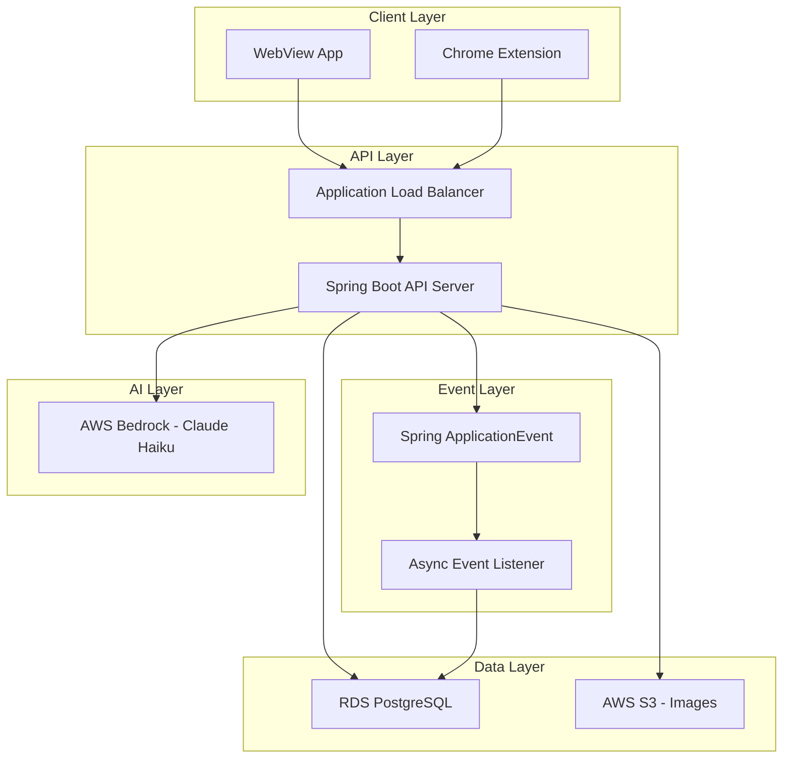
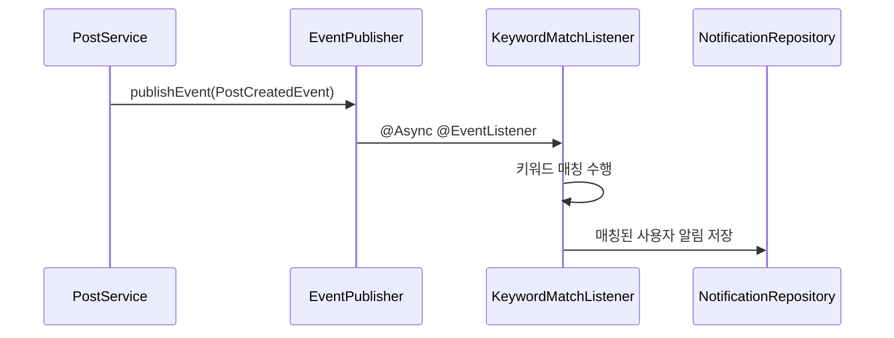
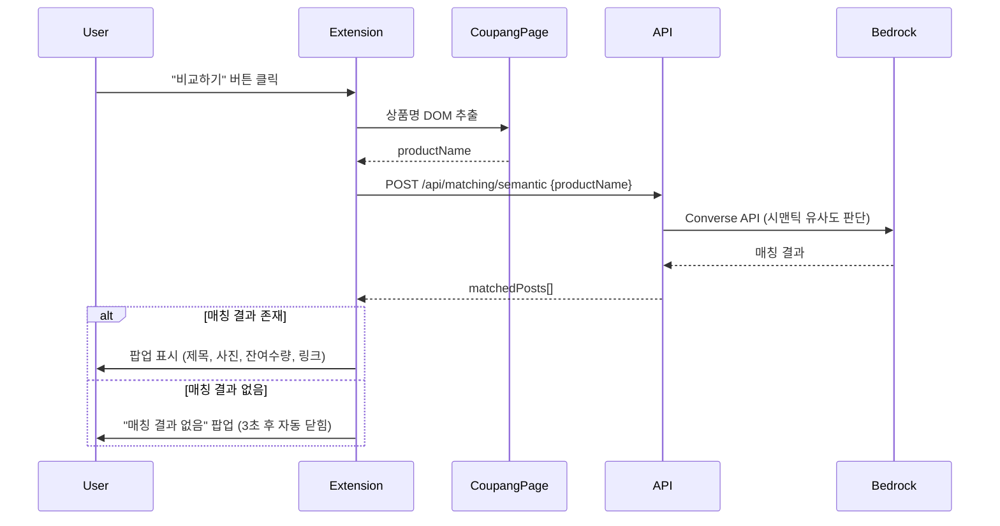
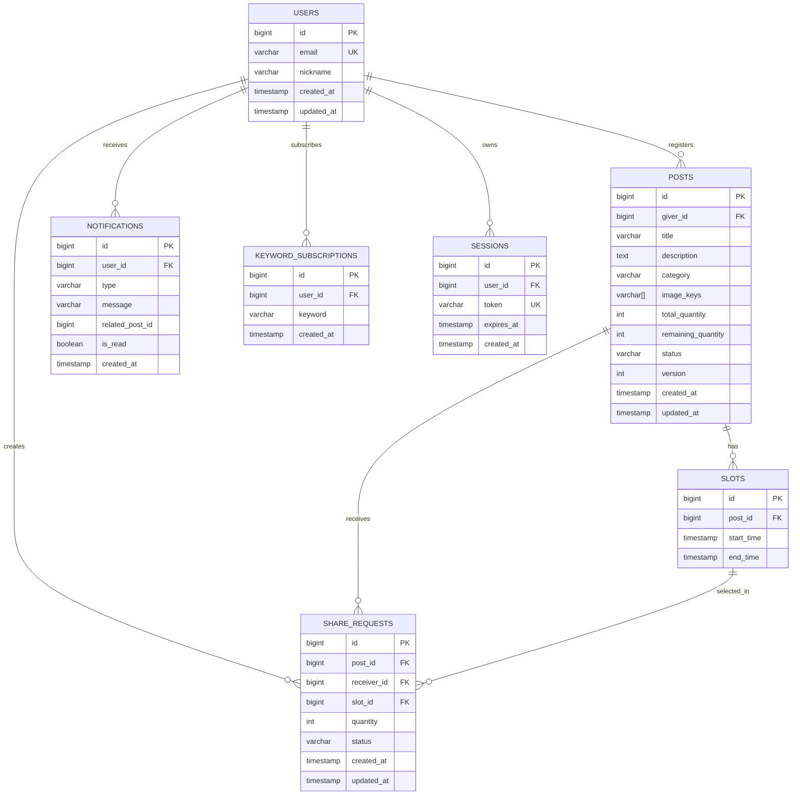

# Design Document: 인하바다 (Inha-Bada)

## Overview

인하바다는 인하대학교 캠퍼스 내 무료 나눔 플랫폼으로, Spring Boot 기반 백엔드와 RDS PostgreSQL(Spring Data JPA)을 핵심 데이터 계층으로 채택한다. 사진 업로드는 S3 Presigned URL을 통해 클라이언트에서 직접 처리하고, 시맨틱 매칭은 AWS Bedrock(Claude Haiku)의 Converse API를 활용한다. 알림 시스템은 Spring ApplicationEvent + @Async 기반 비동기 이벤트 처리 구조로 설계한다.

**주요 설계 결정:**
- **RDS PostgreSQL + Spring Data JPA**: 관계형 데이터 모델을 통한 명확한 엔티티 관계 표현. JPA를 활용한 객체-관계 매핑으로 생산성 향상. 트랜잭션 ACID 보장.
- **S3 Presigned URL**: 서버 대역폭 절약 및 대용량 파일 직접 업로드 지원. 업로드 흐름은 메타데이터 → URL 발급 → 클라이언트 직접 업로드.
- **AWS Bedrock Converse API**: Claude Haiku 모델을 활용한 시맨틱 매칭. AWS 보안 경계 내에서 추론 수행.
- **Spring ApplicationEvent + @Async**: 새 게시글 등록 시 키워드 매칭 알림을 비동기로 처리. 애플리케이션 내부 이벤트 드리븐 구조로 외부 인프라 의존 없이 구현.
- **낙관적 락 (@Version)**: 수량 차감 등 동시성 제어에 JPA 낙관적 락을 적용하여 데이터 정합성 보장.

## Architecture



### 시스템 흐름

1. **메인 피드 조회**: WebView → ALB → Spring Boot → PostgreSQL (JPA Query + 인덱스)
2. **게시글 등록**: WebView → Spring Boot (메타데이터 저장) → S3 Presigned URL 발급 → WebView → S3 직접 업로드 → Spring ApplicationEvent 발행 → Async Listener (키워드 매칭 알림)
3. **나눔 요청/승인**: WebView → Spring Boot → PostgreSQL (트랜잭션 + 낙관적 락) → Spring ApplicationEvent → Async Listener (알림 생성)
4. **시맨틱 매칭**: Chrome Extension → Spring Boot → Bedrock (Claude Haiku) → 매칭 결과 반환
5. **키워드 알림**: Post 등록 → ApplicationEvent 발행 → @Async EventListener → 키워드 매칭 → 알림 레코드 생성

## Components and Interfaces

### 1. Spring Boot API Server

| Controller | 역할 | 엔드포인트 |
|---|---|---|
| FeedController | 메인 피드 조회, 필터링, 검색 | `GET /api/posts`, `GET /api/posts/{id}` |
| PostController | 게시글 등록/수정/마감 | `POST /api/posts`, `PATCH /api/posts/{id}/close` |
| RequestController | 나눔 요청 생성/승인/거절 | `POST /api/posts/{id}/requests`, `PATCH /api/requests/{id}/approve`, `PATCH /api/requests/{id}/reject` |
| UploadController | S3 Presigned URL 발급 | `POST /api/uploads/presigned-url` |
| NotificationController | 알림 목록 조회, 읽음 처리 | `GET /api/notifications`, `PATCH /api/notifications/{id}/read` |
| KeywordController | 관심 키워드 CRUD | `GET/POST/DELETE /api/keywords` |
| MatchingController | 시맨틱 매칭 | `POST /api/matching/semantic` |
| AuthController | 인증 | `POST /api/auth/login`, `POST /api/auth/logout` |
| MyPageController | 마이페이지 | `GET /api/mypage/posts`, `GET /api/mypage/requests` |

### 2. Service Layer

```mermaid
classDiagram
    class PostService {
        +createPost(CreatePostRequest): PostResponse
        +getPostById(postId: Long): PostDetailResponse
        +getActivePosts(filter: FeedFilter, pageable: Pageable): Page~PostCard~
        +closePost(postId: Long, userId: Long): void
    }

    class RequestService {
        +createRequest(postId: Long, req: CreateRequestDto): RequestResponse
        +approveRequest(requestId: Long, giverId: Long): void
        +rejectRequest(requestId: Long, giverId: Long): void
    }

    class UploadService {
        +generatePresignedUrl(fileName: String, contentType: String): PresignedUrlResponse
    }

    class NotificationService {
        +getNotifications(userId: Long, pageable: Pageable): Page~NotificationResponse~
        +markAsRead(notificationId: Long, userId: Long): void
        +createNotification(userId: Long, type: NotificationType, payload: Map): void
    }

    class KeywordService {
        +addKeyword(userId: Long, keyword: String): void
        +removeKeyword(userId: Long, keyword: String): void
        +getKeywords(userId: Long): List~KeywordResponse~
    }

    class SemanticMatchingService {
        +findMatchingPosts(productName: String): List~MatchResult~
    }

    class AuthService {
        +login(credentials: LoginRequest): AuthToken
        +logout(token: String): void
        +validateSession(token: String): UserInfo
    }
```



### 3. Event Layer (Spring ApplicationEvent)



**이벤트 종류:**

| Event | 발행 시점 | Listener 동작 |
|---|---|---|
| `PostCreatedEvent` | 게시글 등록 완료 | 키워드 매칭 → 알림 생성 |
| `RequestCreatedEvent` | 나눔 요청 생성 | Giver에게 알림 생성 |
| `RequestApprovedEvent` | 요청 승인 | Receiver에게 승인 알림 |
| `RequestRejectedEvent` | 요청 거절 | Receiver에게 거절 알림 |
| `PostClosedEvent` | 게시글 수동 마감 | pending 요청 일괄 거절 + 알림 |

### 4. Chrome Extension



### 5. Repository Layer (Spring Data JPA)

```java
// 주요 Repository 인터페이스
public interface PostRepository extends JpaRepository<Post, Long> {
    Page<Post> findByStatusOrderByCreatedAtDesc(PostStatus status, Pageable pageable);
    Page<Post> findByStatusAndCategoryOrderByCreatedAtDesc(PostStatus status, String category, Pageable pageable);
    
    @Query("SELECT p FROM Post p WHERE p.status = :status AND (LOWER(p.title) LIKE LOWER(CONCAT('%', :keyword, '%')) OR LOWER(p.description) LIKE LOWER(CONCAT('%', :keyword, '%')))")
    Page<Post> searchByKeyword(@Param("status") PostStatus status, @Param("keyword") String keyword, Pageable pageable);
    
    List<Post> findByGiverIdOrderByCreatedAtDesc(Long giverId);
}

public interface ShareRequestRepository extends JpaRepository<ShareRequest, Long> {
    List<ShareRequest> findByPostIdAndStatus(Long postId, RequestStatus status);
    List<ShareRequest> findByReceiverIdOrderByCreatedAtDesc(Long receiverId);
    boolean existsByPostIdAndReceiverIdAndStatus(Long postId, Long receiverId, RequestStatus status);
    
    @Query("SELECT COALESCE(SUM(r.quantity), 0) FROM ShareRequest r WHERE r.postId = :postId AND r.status = 'PENDING'")
    int sumPendingQuantityByPostId(@Param("postId") Long postId);
}

public interface NotificationRepository extends JpaRepository<Notification, Long> {
    Page<Notification> findByUserIdOrderByCreatedAtDesc(Long userId, Pageable pageable);
}

public interface KeywordSubscriptionRepository extends JpaRepository<KeywordSubscription, Long> {
    List<KeywordSubscription> findByUserId(Long userId);
    List<KeywordSubscription> findByKeyword(String keyword);
    boolean existsByUserIdAndKeyword(Long userId, String keyword);
    void deleteByUserIdAndKeyword(Long userId, String keyword);
    int countByUserId(Long userId);
}
```

## Data Models

### ERD (Entity-Relationship Diagram)



### JPA Entity 정의

**User Entity:**
```java
@Entity
@Table(name = "users")
public class User {
    @Id @GeneratedValue(strategy = GenerationType.IDENTITY)
    private Long id;

    @Column(unique = true, nullable = false, length = 100)
    private String email;

    @Column(nullable = false, length = 30)
    private String nickname;

    @Column(name = "created_at", nullable = false, updatable = false)
    private LocalDateTime createdAt;

    @Column(name = "updated_at")
    private LocalDateTime updatedAt;
}
```

**Post Entity:**
```java
@Entity
@Table(name = "posts", indexes = {
    @Index(name = "idx_posts_status_created", columnList = "status, created_at DESC"),
    @Index(name = "idx_posts_category_created", columnList = "category, status, created_at DESC"),
    @Index(name = "idx_posts_giver", columnList = "giver_id, created_at DESC")
})
public class Post {
    @Id @GeneratedValue(strategy = GenerationType.IDENTITY)
    private Long id;

    @Column(name = "giver_id", nullable = false)
    private Long giverId;

    @Column(nullable = false, length = 50)
    private String title;

    @Column(nullable = false, columnDefinition = "TEXT")
    private String description;

    @Column(nullable = false, length = 30)
    private String category;

    @Column(name = "image_keys", columnDefinition = "TEXT[]")
    private String[] imageKeys;

    @Column(name = "total_quantity", nullable = false)
    private Integer totalQuantity;

    @Column(name = "remaining_quantity", nullable = false)
    private Integer remainingQuantity;

    @Enumerated(EnumType.STRING)
    @Column(nullable = false, length = 10)
    private PostStatus status;

    @Version
    private Integer version;  // 낙관적 락

    @Column(name = "created_at", nullable = false, updatable = false)
    private LocalDateTime createdAt;

    @Column(name = "updated_at")
    private LocalDateTime updatedAt;

    @OneToMany(mappedBy = "post", cascade = CascadeType.ALL, orphanRemoval = true)
    private List<Slot> slots = new ArrayList<>();
}
```

**Slot Entity:**
```java
@Entity
@Table(name = "slots")
public class Slot {
    @Id @GeneratedValue(strategy = GenerationType.IDENTITY)
    private Long id;

    @ManyToOne(fetch = FetchType.LAZY)
    @JoinColumn(name = "post_id", nullable = false)
    private Post post;

    @Column(name = "start_time", nullable = false)
    private LocalDateTime startTime;

    @Column(name = "end_time", nullable = false)
    private LocalDateTime endTime;
}
```

**ShareRequest Entity:**
```java
@Entity
@Table(name = "share_requests", indexes = {
    @Index(name = "idx_requests_post_status", columnList = "post_id, status"),
    @Index(name = "idx_requests_receiver", columnList = "receiver_id, created_at DESC")
})
public class ShareRequest {
    @Id @GeneratedValue(strategy = GenerationType.IDENTITY)
    private Long id;

    @Column(name = "post_id", nullable = false)
    private Long postId;

    @Column(name = "receiver_id", nullable = false)
    private Long receiverId;

    @Column(name = "slot_id", nullable = false)
    private Long slotId;

    @Column(nullable = false)
    private Integer quantity;

    @Enumerated(EnumType.STRING)
    @Column(nullable = false, length = 10)
    private RequestStatus status;

    @Column(name = "created_at", nullable = false, updatable = false)
    private LocalDateTime createdAt;

    @Column(name = "updated_at")
    private LocalDateTime updatedAt;
}
```

**Notification Entity:**
```java
@Entity
@Table(name = "notifications", indexes = {
    @Index(name = "idx_notifications_user_created", columnList = "user_id, created_at DESC")
})
public class Notification {
    @Id @GeneratedValue(strategy = GenerationType.IDENTITY)
    private Long id;

    @Column(name = "user_id", nullable = false)
    private Long userId;

    @Enumerated(EnumType.STRING)
    @Column(nullable = false, length = 30)
    private NotificationType type;

    @Column(nullable = false, length = 200)
    private String message;

    @Column(name = "related_post_id")
    private Long relatedPostId;

    @Column(name = "is_read", nullable = false)
    private Boolean isRead = false;

    @Column(name = "created_at", nullable = false, updatable = false)
    private LocalDateTime createdAt;
}
```

**KeywordSubscription Entity:**
```java
@Entity
@Table(name = "keyword_subscriptions", 
    uniqueConstraints = @UniqueConstraint(columnNames = {"user_id", "keyword"}),
    indexes = {
        @Index(name = "idx_keyword_subs_user", columnList = "user_id"),
        @Index(name = "idx_keyword_subs_keyword", columnList = "keyword")
    })
public class KeywordSubscription {
    @Id @GeneratedValue(strategy = GenerationType.IDENTITY)
    private Long id;

    @Column(name = "user_id", nullable = false)
    private Long userId;

    @Column(nullable = false, length = 20)
    private String keyword;

    @Column(name = "created_at", nullable = false, updatable = false)
    private LocalDateTime createdAt;
}
```

**Session Entity:**
```java
@Entity
@Table(name = "sessions", indexes = {
    @Index(name = "idx_sessions_token", columnList = "token", unique = true),
    @Index(name = "idx_sessions_user", columnList = "user_id"),
    @Index(name = "idx_sessions_expires", columnList = "expires_at")
})
public class Session {
    @Id @GeneratedValue(strategy = GenerationType.IDENTITY)
    private Long id;

    @Column(name = "user_id", nullable = false)
    private Long userId;

    @Column(nullable = false, unique = true, length = 64)
    private String token;

    @Column(name = "expires_at", nullable = false)
    private LocalDateTime expiresAt;

    @Column(name = "created_at", nullable = false, updatable = false)
    private LocalDateTime createdAt;
}
```

### Enum 정의

```java
public enum PostStatus {
    ACTIVE, CLOSED
}

public enum RequestStatus {
    PENDING, APPROVED, REJECTED
}

public enum NotificationType {
    KEYWORD_MATCH,      // 키워드 매칭 알림
    REQUEST_RECEIVED,   // 새 요청 수신 (Giver)
    REQUEST_APPROVED,   // 요청 승인 (Receiver)
    REQUEST_REJECTED    // 요청 거절 (Receiver)
}
```

### PostgreSQL DDL

```sql
-- Posts 테이블
CREATE TABLE posts (
    id BIGSERIAL PRIMARY KEY,
    giver_id BIGINT NOT NULL REFERENCES users(id),
    title VARCHAR(50) NOT NULL,
    description TEXT NOT NULL,
    category VARCHAR(30) NOT NULL,
    image_keys TEXT[] NOT NULL,
    total_quantity INTEGER NOT NULL CHECK (total_quantity BETWEEN 1 AND 99),
    remaining_quantity INTEGER NOT NULL CHECK (remaining_quantity >= 0),
    status VARCHAR(10) NOT NULL DEFAULT 'ACTIVE',
    version INTEGER NOT NULL DEFAULT 0,
    created_at TIMESTAMP NOT NULL DEFAULT NOW(),
    updated_at TIMESTAMP
);

CREATE INDEX idx_posts_status_created ON posts(status, created_at DESC);
CREATE INDEX idx_posts_category_created ON posts(category, status, created_at DESC);
CREATE INDEX idx_posts_giver ON posts(giver_id, created_at DESC);
-- 키워드 검색용 GIN 인덱스 (pg_trgm 확장 활용)
CREATE INDEX idx_posts_title_trgm ON posts USING GIN (title gin_trgm_ops);
CREATE INDEX idx_posts_desc_trgm ON posts USING GIN (description gin_trgm_ops);

-- Slots 테이블
CREATE TABLE slots (
    id BIGSERIAL PRIMARY KEY,
    post_id BIGINT NOT NULL REFERENCES posts(id) ON DELETE CASCADE,
    start_time TIMESTAMP NOT NULL,
    end_time TIMESTAMP NOT NULL,
    CHECK (end_time > start_time)
);

CREATE INDEX idx_slots_post ON slots(post_id);

-- Share Requests 테이블
CREATE TABLE share_requests (
    id BIGSERIAL PRIMARY KEY,
    post_id BIGINT NOT NULL REFERENCES posts(id),
    receiver_id BIGINT NOT NULL REFERENCES users(id),
    slot_id BIGINT NOT NULL REFERENCES slots(id),
    quantity INTEGER NOT NULL CHECK (quantity >= 1),
    status VARCHAR(10) NOT NULL DEFAULT 'PENDING',
    created_at TIMESTAMP NOT NULL DEFAULT NOW(),
    updated_at TIMESTAMP
);

CREATE INDEX idx_requests_post_status ON share_requests(post_id, status);
CREATE INDEX idx_requests_receiver ON share_requests(receiver_id, created_at DESC);

-- Notifications 테이블
CREATE TABLE notifications (
    id BIGSERIAL PRIMARY KEY,
    user_id BIGINT NOT NULL REFERENCES users(id),
    type VARCHAR(30) NOT NULL,
    message VARCHAR(200) NOT NULL,
    related_post_id BIGINT REFERENCES posts(id),
    is_read BOOLEAN NOT NULL DEFAULT FALSE,
    created_at TIMESTAMP NOT NULL DEFAULT NOW()
);

CREATE INDEX idx_notifications_user_created ON notifications(user_id, created_at DESC);

-- Keyword Subscriptions 테이블
CREATE TABLE keyword_subscriptions (
    id BIGSERIAL PRIMARY KEY,
    user_id BIGINT NOT NULL REFERENCES users(id),
    keyword VARCHAR(20) NOT NULL,
    created_at TIMESTAMP NOT NULL DEFAULT NOW(),
    UNIQUE(user_id, keyword)
);

CREATE INDEX idx_keyword_subs_user ON keyword_subscriptions(user_id);
CREATE INDEX idx_keyword_subs_keyword ON keyword_subscriptions(keyword);

-- Sessions 테이블
CREATE TABLE sessions (
    id BIGSERIAL PRIMARY KEY,
    user_id BIGINT NOT NULL REFERENCES users(id),
    token VARCHAR(64) NOT NULL UNIQUE,
    expires_at TIMESTAMP NOT NULL,
    created_at TIMESTAMP NOT NULL DEFAULT NOW()
);

CREATE INDEX idx_sessions_token ON sessions(token);
CREATE INDEX idx_sessions_expires ON sessions(expires_at);
```

### 주요 액세스 패턴과 쿼리

| 액세스 패턴 | 쿼리 전략 | 인덱스 |
|---|---|---|
| 활성 피드 조회 (최신순) | `WHERE status='ACTIVE' ORDER BY created_at DESC` | `idx_posts_status_created` |
| 카테고리 필터 | `WHERE category=? AND status='ACTIVE' ORDER BY created_at DESC` | `idx_posts_category_created` |
| 키워드 검색 | `WHERE status='ACTIVE' AND (title ILIKE '%keyword%' OR description ILIKE '%keyword%')` | `idx_posts_title_trgm`, `idx_posts_desc_trgm` |
| 게시글 상세 + 슬롯 | `Post findById` + `Slot findByPostId` (JPA Lazy Fetch) | PK |
| 내가 올린 나눔 | `WHERE giver_id=? ORDER BY created_at DESC` | `idx_posts_giver` |
| 내가 받은 나눔 | `WHERE receiver_id=? ORDER BY created_at DESC` | `idx_requests_receiver` |
| 알림 최신순 조회 | `WHERE user_id=? ORDER BY created_at DESC` | `idx_notifications_user_created` |
| 내 키워드 목록 | `WHERE user_id=?` | `idx_keyword_subs_user` |
| 키워드 → 사용자 매칭 | `WHERE keyword=?` | `idx_keyword_subs_keyword` |
| pending 수량 합산 | `SELECT SUM(quantity) WHERE post_id=? AND status='PENDING'` | `idx_requests_post_status` |

### 동시성 제어 전략

**낙관적 락 (Optimistic Locking):**

Post 엔티티의 `@Version` 필드를 활용하여, 수량 차감 시 동시 요청으로 인한 데이터 불일치를 방지한다.

```java
@Service
@Transactional
public class RequestService {
    
    public void approveRequest(Long requestId, Long giverId) {
        ShareRequest request = requestRepository.findById(requestId)
            .orElseThrow(() -> new NotFoundException("요청을 찾을 수 없습니다"));
        
        Post post = postRepository.findById(request.getPostId())
            .orElseThrow(() -> new NotFoundException("게시글을 찾을 수 없습니다"));
        
        // 권한 확인
        if (!post.getGiverId().equals(giverId)) {
            throw new ForbiddenException("권한이 없습니다");
        }
        
        // 수량 차감 (낙관적 락으로 동시성 보호)
        if (post.getRemainingQuantity() < request.getQuantity()) {
            throw new ConflictException("잔여 수량이 부족합니다");
        }
        
        post.setRemainingQuantity(post.getRemainingQuantity() - request.getQuantity());
        request.setStatus(RequestStatus.APPROVED);
        
        // @Version에 의해 OptimisticLockException 발생 시 재시도
        postRepository.save(post);
        requestRepository.save(request);
        
        // 알림 이벤트 발행
        eventPublisher.publishEvent(new RequestApprovedEvent(request));
    }
}
```

**OptimisticLockException 재시도:**
```java
@Retryable(value = OptimisticLockException.class, maxAttempts = 3, backoff = @Backoff(delay = 100))
public void approveRequest(Long requestId, Long giverId) { ... }
```

### S3 버킷 구조

```
inha-bada-images/
├── posts/{postId}/{uuid}.{ext}     # 게시글 이미지
└── profiles/{userId}/avatar.{ext}  # 프로필 이미지 (향후 확장)
```

### Bedrock 시맨틱 매칭 설계

Chrome Extension에서 추출된 쿠팡 상품명을 AWS Bedrock Claude Haiku에 전달하여, 현재 활성 게시글 중 의미적으로 유사한 항목을 찾는다.

**매칭 흐름:**
1. 활성 게시글 목록을 PostgreSQL에서 조회 (최근 N개 또는 카테고리 기반)
2. 상품명 + 게시글 제목/설명을 프롬프트로 구성
3. Bedrock Converse API로 유사도 판단 요청
4. 유사도 점수 기반 상위 결과 반환 (0.7 이상, 최대 5개)

**프롬프트 구조 예시:**
```
주어진 쿠팡 상품명과 아래 나눔 게시글 목록을 비교하여, 
의미적으로 유사한 게시글을 JSON 배열로 반환해주세요.
유사도 0.7 이상인 항목만 포함하세요.

상품명: "{productName}"

게시글 목록:
{posts as JSON array with id, title, description}

응답 형식: [{"postId": "...", "similarity": 0.85, "reason": "..."}]
```

### 키워드 매칭 알림 구현 (Spring Event)

```java
@Component
public class KeywordMatchEventListener {

    @Async
    @TransactionalEventListener(phase = TransactionPhase.AFTER_COMMIT)
    public void handlePostCreated(PostCreatedEvent event) {
        Post post = event.getPost();
        String searchText = (post.getTitle() + " " + post.getDescription()).toLowerCase();
        
        // 모든 고유 키워드 조회
        List<KeywordSubscription> allSubscriptions = keywordSubscriptionRepository.findAll();
        
        // 키워드별로 그룹핑하여 매칭 수행
        Map<String, List<KeywordSubscription>> keywordGroups = allSubscriptions.stream()
            .collect(Collectors.groupingBy(KeywordSubscription::getKeyword));
        
        for (Map.Entry<String, List<KeywordSubscription>> entry : keywordGroups.entrySet()) {
            String keyword = entry.getKey().toLowerCase();
            if (searchText.contains(keyword)) {
                for (KeywordSubscription sub : entry.getValue()) {
                    // 본인 게시글에는 알림 미전송
                    if (!sub.getUserId().equals(post.getGiverId())) {
                        notificationService.createNotification(
                            sub.getUserId(),
                            NotificationType.KEYWORD_MATCH,
                            Map.of("keyword", entry.getKey(), "postId", post.getId())
                        );
                    }
                }
            }
        }
    }
}
```

## Correctness Properties

*A property is a characteristic or behavior that should hold true across all valid executions of a system—essentially, a formal statement about what the system should do. Properties serve as the bridge between human-readable specifications and machine-verifiable correctness guarantees.*

### Property 1: 활성 피드 필터링 정확성

*For any* 상태가 혼합된 게시글 집합과 카테고리 필터, 피드 조회 결과는 ACTIVE 상태인 게시글만 포함해야 하며, 카테고리 필터가 적용된 경우 해당 카테고리 게시글만 반환되어야 한다.

**Validates: Requirements 1.1, 1.2**

### Property 2: 키워드 검색 정확성

*For any* 키워드와 게시글 집합, 검색 결과에 포함된 모든 게시글은 제목 또는 설명에 해당 키워드를 부분 문자열로 포함해야 한다.

**Validates: Requirements 1.3**

### Property 3: 커서 기반 페이지네이션 무결성

*For any* N개의 활성 게시글과 페이지 크기 M, 페이지네이션으로 모든 페이지를 순회하면 중복 없이 정확히 N개의 게시글이 시간 역순으로 반환되어야 한다.

**Validates: Requirements 1.4**

### Property 4: 잔여수량 0 마감 표시

*For any* 게시글, remainingQuantity가 0이면 피드에서 마감 상태로 표시되고 나눔 요청이 거부되어야 하며, 0보다 크면 활성 상태여야 한다.

**Validates: Requirements 1.5, 3.3**

### Property 5: 인증 접근 제어

*For any* 인증이 필요한 API 엔드포인트, 유효한 인증 토큰 없이 접근하면 401 응답이 반환되어야 한다.

**Validates: Requirements 1.7, 9.1**

### Property 6: 수령 일정 시간 검증

*For any* 시작 시각과 종료 시각 쌍, 종료 시각이 시작 시각 이후이고 시작 시각이 현재 시각 이후인 경우에만 슬롯 등록이 허용되어야 한다.

**Validates: Requirements 2.5, 2.6**

### Property 7: 게시글 등록 입력 검증

*For any* 게시글 등록 요청에서 수량 범위(1~99), 사진 수(1~5), 제목 길이(1~50자), 슬롯 수(1~10) 범위를 벗어나거나 필수 필드가 누락된 경우, 등록이 거부되고 오류 메시지에 해당 검증 실패 사유가 포함되어야 한다.

**Validates: Requirements 2.2, 2.3, 2.4, 2.7, 2.9**

### Property 8: 게시글 상세 응답 완전성

*For any* 유효한 게시글, 상세 조회 응답에는 제목, 설명, 사진 URL, remainingQuantity, totalQuantity, giverId, giverName, createdAt, 슬롯 목록 필드가 모두 포함되어야 한다.

**Validates: Requirements 3.1, 3.2**

### Property 9: 나눔 요청 수량 제한

*For any* 게시글에 대해 모든 pending 상태 요청의 수량 합산과 신규 요청 수량의 합이 remainingQuantity를 초과하면 요청 생성이 거부되어야 한다.

**Validates: Requirements 4.2, 4.3**

### Property 10: 요청 상태 초기화

*For any* 유효하게 생성된 나눔 요청, 초기 상태는 항상 PENDING이어야 한다.

**Validates: Requirements 4.4**

### Property 11: 요청 상태 전이와 알림

*For any* pending 상태의 요청에 대해 Giver가 승인/거절하면, 요청 상태가 APPROVED/REJECTED로 변경되고 Receiver에게 해당 상태 변경 알림이 생성되어야 한다.

**Validates: Requirements 4.5, 4.6, 4.7**

### Property 12: 승인 시 수량 차감 정확성

*For any* 승인된 요청의 수량 Q, 승인 전 remainingQuantity - Q = 승인 후 remainingQuantity가 성립해야 한다.

**Validates: Requirements 4.8**

### Property 13: 마이페이지 소유자 격리

*For any* 사용자, "내가 올린 나눔" 조회는 본인이 등록한 게시글만, "내가 받은 나눔" 조회는 본인이 요청한 Request만 포함해야 한다.

**Validates: Requirements 5.2, 5.3**

### Property 14: 수동 마감 시 pending 요청 자동 거절

*For any* 활성 게시글의 수동 마감 시, 해당 게시글에 남아있는 모든 pending 상태 Request가 REJECTED로 변경되고 각 Receiver에게 거절 알림이 생성되어야 한다.

**Validates: Requirements 5.4**

### Property 15: 키워드 CRUD 라운드트립

*For any* 사용자와 유효한 키워드 집합(1~20자, 최대 20개), 키워드를 등록한 후 목록 조회 시 등록한 모든 키워드가 포함되어야 하고, 삭제한 키워드는 목록에서 사라져야 하며, 중복 등록은 거부되어야 한다.

**Validates: Requirements 7.1, 7.2, 7.3, 7.4**

### Property 16: 키워드 매칭 알림 생성

*For any* 새로 등록된 게시글과 사용자의 관심 키워드, 게시글의 제목 또는 설명에 키워드가 부분 문자열로 포함되면 해당 사용자에게 알림이 생성되어야 하고, 포함되지 않으면 알림이 생성되지 않아야 한다.

**Validates: Requirements 6.1**

### Property 17: 알림 시간순 정렬

*For any* 사용자의 알림 목록, 반환된 알림들은 생성 시간 역순으로 정렬되어야 한다.

**Validates: Requirements 6.3**

### Property 18: 매칭 결과 응답 완전성

*For any* 시맨틱 매칭 결과에 포함된 게시글, 응답에는 제목, 사진 URL, remainingQuantity, 웹뷰 이동 링크가 모두 포함되어야 한다.

**Validates: Requirements 8.4**

### Property 19: 인증 세션 라운드트립

*For any* 유효한 @inha.edu 이메일 인증 정보로 로그인 후 발급된 세션 토큰, 해당 토큰으로 인증이 필요한 API 접근이 가능해야 한다.

**Validates: Requirements 9.2, 9.3**

### Property 20: 인증 실패 오류 메시지

*For any* @inha.edu가 아닌 이메일 또는 잘못된 인증 정보로 로그인 시도, 응답에는 인증 실패 사유를 포함한 오류 메시지가 반환되어야 한다.

**Validates: Requirements 9.4**

## Error Handling

### API 레벨 에러 처리

| HTTP Status | 상황 | 응답 형식 |
|---|---|---|
| 400 Bad Request | 입력 검증 실패 (필수 필드 누락, 잘못된 수량, 키워드 길이 초과 등) | `{"error": "VALIDATION_ERROR", "fields": ["title", "quantity"], "message": "..."}` |
| 401 Unauthorized | 인증 토큰 없음 또는 만료 | `{"error": "UNAUTHORIZED", "message": "로그인이 필요합니다"}` |
| 403 Forbidden | 권한 없음 (타인 게시글 마감 시도, 본인 게시글 요청 등) | `{"error": "FORBIDDEN", "message": "권한이 없습니다"}` |
| 404 Not Found | 존재하지 않는 리소스 | `{"error": "NOT_FOUND", "message": "게시글을 찾을 수 없습니다"}` |
| 409 Conflict | 수량 초과 요청, 중복 pending 요청, 중복 키워드, 낙관적 락 실패 | `{"error": "CONFLICT", "message": "잔여 수량을 초과하는 요청입니다"}` |
| 500 Internal Server Error | 서버 내부 오류 | `{"error": "INTERNAL_ERROR", "message": "서버 오류가 발생했습니다"}` |

### PostgreSQL 에러 처리

- **OptimisticLockException**: 수량 차감 시 동시성 충돌 → @Retryable (최대 3회, 100ms 백오프) → 실패 시 409 반환
- **DataIntegrityViolationException**: 유니크 제약 위반 (중복 키워드 등) → 409 반환
- **PessimisticLockException**: 타임아웃 → 503 반환 + 재시도 안내
- **Connection Pool Exhaustion**: HikariCP 커넥션 풀 고갈 → 503 + Circuit Breaker 활성화

### S3 Presigned URL 에러 처리

- URL 만료 (기본 10분): 클라이언트에게 재발급 안내
- 파일 크기 초과: Presigned URL 생성 시 조건 설정 (최대 10MB)
- 잘못된 Content-Type: Presigned URL에 Content-Type 조건 포함

### Bedrock 시맨틱 매칭 에러 처리

- **ThrottlingException**: 재시도 (지수 백오프, 최대 3회)
- **ModelTimeoutException**: 타임아웃 → 빈 결과 반환
- **ValidationException**: 프롬프트 검증 실패 → 로그 기록 + 빈 결과 반환

### 비동기 이벤트 처리 에러 (Spring @Async)

- EventListener 내 예외 발생: 로그 기록 + 알림 생성 실패 시 자동 재시도 (@Retryable, 최대 3회)
- 재시도 실패: 별도 실패 로그 테이블에 기록하여 운영자 모니터링
- 트랜잭션 격리: `@TransactionalEventListener(phase = AFTER_COMMIT)` 사용으로 메인 트랜잭션 성공 후에만 이벤트 처리

## Testing Strategy

### 단위 테스트 (Unit Tests)

서비스 레이어의 비즈니스 로직을 Mockito 기반으로 테스트한다.

- **PostService**: 게시글 생성 입력 검증, 마감 처리 로직, 상태 초기화
- **RequestService**: 수량 검증, 상태 전이, 수량 차감, 본인 요청 거부, 중복 요청 거부
- **NotificationService**: 알림 생성 로직, 읽음 처리
- **KeywordService**: CRUD 동작, 중복 검증, 최대 개수 제한, 길이 검증
- **SemanticMatchingService**: 프롬프트 구성, 응답 파싱, 유사도 필터링
- **AuthService**: 이메일 도메인 검증, 세션 생성/검증/만료
- **KeywordMatchEventListener**: 키워드 매칭 로직, 알림 생성 조건

### 프로퍼티 기반 테스트 (Property-Based Tests)

**라이브러리**: [jqwik](https://jqwik.net/) (JUnit5 기반 Java PBT 프레임워크)

각 Correctness Property를 jqwik의 `@Property` 어노테이션으로 구현한다.

**설정:**
- 최소 100회 반복 (`tries = 100`)
- 각 테스트에 해당 프로퍼티 번호 태그 포함
- 태그 형식: `Feature: inha-bada, Property {number}: {property_text}`

**주요 프로퍼티 테스트 대상:**
- 피드 필터링/검색/페이지네이션 정확성 (Property 1-4)
- 게시글 등록 입력 검증 (Property 7)
- 수량 제한 및 차감 로직 (Property 9, 12)
- 키워드 CRUD 라운드트립 (Property 15)
- 키워드 매칭 알림 로직 (Property 16)
- 인증 접근 제어 및 도메인 검증 (Property 5, 19, 20)
- 슬롯 시간 검증 (Property 6)

### 통합 테스트 (Integration Tests)

- **Testcontainers + PostgreSQL**: 실제 PostgreSQL 인스턴스를 사용한 JPA Repository 계층 테스트
- **@DataJpaTest**: 각 Repository 메서드의 쿼리 정확성 검증
- **S3 Mock (LocalStack)**: Presigned URL 발급 및 업로드 흐름 테스트
- **Bedrock Mock**: 시맨틱 매칭 API 호출/응답 통합 테스트
- **Spring Event 테스트**: 게시글 등록 → ApplicationEvent 발행 → 알림 생성 E2E 흐름

### Chrome Extension 테스트

- **DOM 파싱 테스트**: 쿠팡 페이지 mock HTML에서 상품명 추출 정확성
- **팝업 렌더링 테스트**: 매칭 결과 팝업의 필수 요소 표시 확인
- **링크 구성 테스트**: 웹뷰 URL이 올바르게 구성되는지 확인
